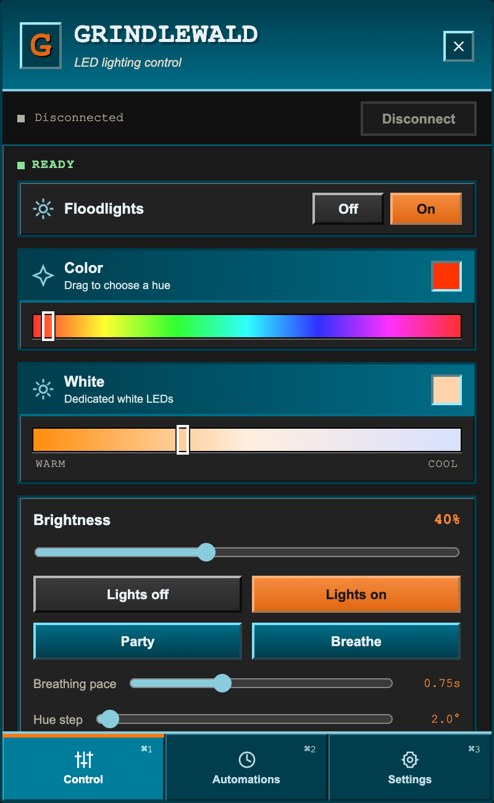
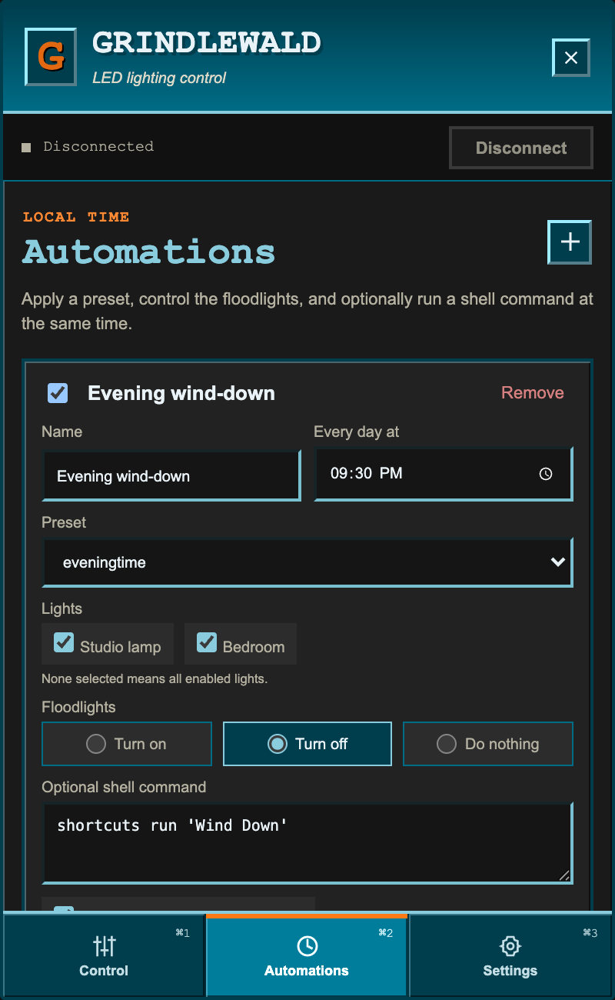
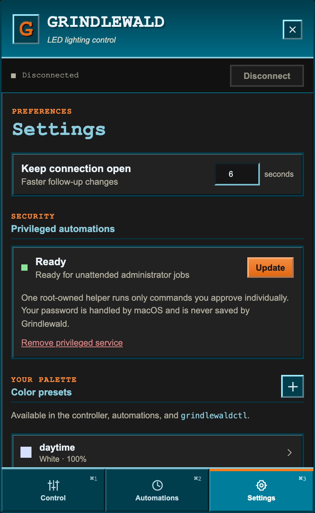

# Grindlewald

Grindlewald is a small macOS menu-bar app for controlling Govee Bluetooth lights directly. It is built with Rust and Tauri, keeps connections warm while you adjust a color, and has both a visual controller and a scriptable CLI.

<p align="center">
  
  
  
</p>

## Highlights

- Native macOS menu-bar app with no Dock icon
- Separate native color wells for RGB mode and the bulbs' dedicated-white mode
- Picker input switches mode immediately while dragging
- BLE connections remain open for six seconds after activity, making follow-up color changes fast
- Named color presets shared by the UI, CLI, and automations
- Bluetooth discovery plus add, edit, enable, and remove controls for individual lights
- Daily local-time automations targeting one, several, or all enabled lights
- Optional trusted shell command run alongside an automation, with a full Test button
- Local Unix-socket CLI, so terminal commands benefit from the menu app's warm BLE connections too

## Setup

Requirements: macOS, Bluetooth, Rust, Node.js, and [pnpm](https://pnpm.io/).

```sh
pnpm install
pnpm tauri dev
```

Click the **G** menu-bar icon, open **Settings**, and choose **Discover**. Add each light and select its protocol:

- **H6005** for H6005-series devices
- **Classic** for the older Govee BLE packet mode

macOS will ask for Bluetooth permission the first time Grindlewald scans or connects. Device names and CoreBluetooth identifiers are saved to:

```text
~/Library/Application Support/com.jonahclarsen.grindlewald/settings.json
```

That file is local runtime data. It is ignored by Git and is never compiled into the app.

## Command-line control

The menu-bar app must be running because `grindlewaldctl` sends commands to its private local socket. Build or install the CLI once:

```sh
cargo install --path src-tauri --bin grindlewaldctl --force
```

Examples:

```sh
# Apply named presets to every enabled light or one light by name
grindlewaldctl preset nighttime
grindlewaldctl preset nighttime --light "Studio lamp"

# Direct RGB and dedicated-white colors
grindlewaldctl color '#ff4500' --brightness 0.35
grindlewaldctl white '#ffd5ad' --brightness 0.7 --light Bedroom

# Brightness and power
grindlewaldctl brightness 0.2
grindlewaldctl power off --light Bedroom
```

Brightness values range from `0.0` through `1.0`. Preset and light names are case-insensitive at execution time. You can add and edit presets on the **Presets** page.

## Automations

On **Timers**, create an automation, choose its daily local time and preset, then select any number of lights. Selecting no lights means all enabled lights. The scheduler runs inside the menu-bar process, so keep Grindlewald running.

An automation may also run a shell command through `/bin/zsh -lc`. The command is stored only in the local settings file. Use this only for commands you trust; it intentionally has the same permissions as your user account. **Test light + script now** saves the automation and runs both halves immediately.

## Start automatically as a debug app

To install the included per-user LaunchAgent:

```sh
./scripts/install-launch-agent.sh
```

The installer builds a debug-mode `Grindlewald.app`, copies it to `~/Applications`, and registers a per-user LaunchAgent that runs its bundled executable at login and restarts it if it exits. The agent is explicitly associated with the Grindlewald bundle identifier, so both Bluetooth permission and the System Settings Background Items entry use **Grindlewald** instead of a shell or launcher name. Logs are written under `~/Library/Logs/Grindlewald`.

Re-run the installer after changing source code to rebuild and refresh the installed debug app. The login process itself does not need shell or Documents-folder permission.

Remove it with:

```sh
./scripts/uninstall-launch-agent.sh
```

## How the light protocol works

Grindlewald follows the same direct-BLE packet logic as the scripts that preceded it. Commands are padded to 19 bytes and followed by an XOR checksum. RGB mode uses manual mode `0x02` (or `0x0d` for H6005), while dedicated-white mode sets the white-channel flag and includes the selected white hue. Color and brightness writes are sent together to all selected lights.

## Privacy and repository safety

No device identifier, credential, API key, user automation, or personal filesystem path is included in this repository. The screenshots use synthetic demo devices. Before publishing changes, inspect staged files and keep all real configuration in Application Support.

## License

[MIT](LICENSE)
